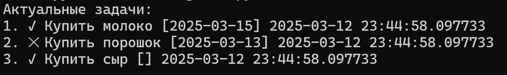

# Часть 1: Вывод информации обо всех задачах
Итоговый результат работы программы
- Чтение информации из файла [с определённой структурой](https://github.com/0106-25-python/p1_s1/blob/main/db.txt)
- Переработка и вывод на экран информации в следующем виде



Статус задачи выводим в виде символа:
- active - ✓
- done - ✕

## Шаг 1: Выводим информацию из файла as is
Последовательность действий:
- Читаем всю информацию из файла
- Разделяем на конкретные задачи
- Выводим информацию о задаче в консоль в формате
```
Задача 1: d7ef9ffb-31b6-4914-b223-2a409b6e9599<>Купить молоко<>[2025-03-15]<>2025-03-12 23:44:58.097733<>active
Задача 2: 87d4799f-98ba-4786-bb69-b71e362917d0<>Купить порошок<>[2025-03-13]<>2025-03-12 23:44:58.097733<>done
Задача 3: 63749e6e-d88d-49fa-982f-9fbf5840e585<>Купить сыр<>[]<>2025-03-12 23:44:58.097733<>active
```

### Что нам пригодится из возможностей Python
1) Функция [open()](https://docs.python.org/3/library/functions.html#open)

```python
file_object = open("db.txt", "r", encoding="utf8") #открываем файл на чтение; инициализируем переменную, которая содержит объект файл; дополнительно указываем кодировку
file_content = file_object.read() #инициализируем переменную, которой присваивается весь контент файла
file_object.close() #всегда хорошая практика закрывать файл после действий с его контентом, если не планируете больше что-то с ним делать
```

2) Функция [splitlines()](https://docs.python.org/3/library/stdtypes.html#str.splitlines)

```python
string_to_list = """Это первая строка.
Это вторая строка."""
splitted_string = string_to_list.splitlines() #вызов функции возвращает список, состоящий из 2-х строк
```

3) Использование циклов с помощью конструкции [for](https://docs.python.org/3/tutorial/controlflow.html#for-statements)
```python
string_to_list = """Это первая строка.
Это вторая строка."""
splitted_string = string_to_list.splitlines()
for specific_line in splitted_string: #запускаем цикл с перебором списка
  print(specific_line) #выводим конкретный элемент из списка
```

4) Вывод информации в консоль с помощью функции [print()](https://docs.python.org/3/library/functions.html#print)
```python
print("Простой вывод строки")
```

## Шаг 2: Выделяем функции

Преобразование линейного кода в набор функций:
- Чтение данных из БД и возврат всей информации в виде простой строки
- Преобразование строки в список задач
- Вывод списка задач в консоль

Все функции вызываются последовательно и используют результаты выполнения предыдущей.

### Что нам пригодится из Python
1) Определение [функций](https://docs.python.org/3/tutorial/controlflow.html#defining-functions)
```python
def simple_function():
  print("Простейшая функция без параметров, которая ничего не возвращает")

simple_function() #вызов функции

def simple_function_w_params(param1):
  print(param1) #выводим в консоль значение переданного параметра

simple_function("Простая строка")

def simple_function_w_return(param1):
  return param1 * 2 #возвращаем значение результата работы функции

function_result = simple_function_w_return(3) #вызываем функцию и получаем результаты её выполнения
print(function_result)
```

## Шаг 3: Формируем итоговый вывод
Выделение информации о конкретной задаче и преобразование вывода:
- не выводим ряд параметров задачи
- проверяем статус и выводим соответствующий символ

### Что нам пригодится из Python
1) Функция [split()](https://docs.python.org/3/library/stdtypes.html#str.split)
```python
string_to_list_sep = "Первый элемент*Второй элемент*Третий элемент"
splitted_string_sep = string_to_list_sep.split("*") #разбиваем строку на набор подстрок по конкретному разделителю
```

2) Логический оператор [if/else](https://docs.python.org/3/tutorial/controlflow.html#if-statements)
```python
a = 3
if a < 5:
  print("а меньше 5")
else:
  print("а явно больше 5")
```
3) Функция добавления элементов в список [append()](https://docs.python.org/3/library/array.html#array.array.append)
```python
test_list = [] #инициализация пустого списка
test_list.append("Первое значение") #добавляем значение в конец списка
test_list.append("Второе значение") #добавляем значение в конец списка
test_list.append(25) #добавляем значение в конец списка
```
